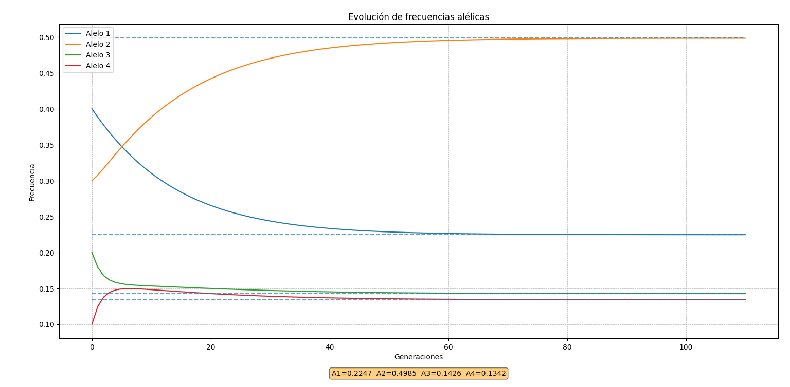

# Hardy–Weinberg – Simulador de Mutación Alélica

Un simple simulador en Python que modela la evolución de frecuencias alélicas bajo un proceso de mutación discreto. Permite:

* Definir una matriz de tasas de mutación entre varios alelos.
* Simular generación tras generación hasta alcanzar el equilibrio.
* Detectar alelos aislados (sin entradas ni salidas) y tratarlos de forma separada.
* Calcular la distribución estacionaria mediante resolución de un sistema lineal con normalización.
* Mostrar la evolución gráfica de las frecuencias y sus valores de equilibrio.

---

## Contenido

* `simulador_mutacion.py`: código fuente principal con funciones para construir la matriz de mutación, simular generaciones, hallar el equilibrio y graficar resultados.
* `README.md`: esta documentación.

---

## Requisitos

* Python 3.8 o superior
* [NumPy](https://numpy.org/)
* [Matplotlib](https://matplotlib.org/)

Instálalos con:

```bash
pip install numpy matplotlib
```

---

## Uso

1. Edita la sección de parámetros en `simulador_mutacion.py`:

   * `f0`: vector de frecuencias iniciales (debe sumar 1).
   * `raw_mut`: matriz de tasas de mutación (sin diagonal completa).
   * `tol` (opcional): tolerancia de convergencia.
   * `max_iter` (opcional): máximo de generaciones a simular.

2. Ejecuta:

   ```bash
   python simulador_mutacion.py
   ```

3. Obtendrás una ventana con la gráfica de la evolución de frecuencias y la línea de equilibrio de cada alelo.

---

## Ejemplo

```python
# En simulador_mutacion.py
f0 = np.array([0.4, 0.3, 0.2, 0.1])
raw_mut = np.array([
    [0,    0.01, 0.005, 0.03],
    [0.02, 0,    0.01,  0.01],
    [0.001,0.03, 0,     0.2 ],
    [0,    0.1,  0.2,   0   ],
])
init_simulation(f0, raw_mut)
```


